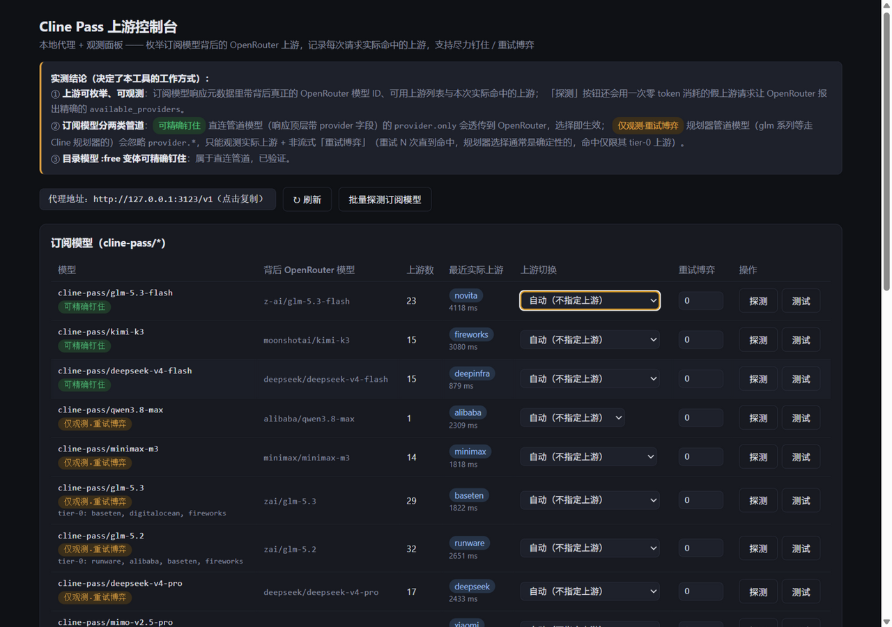
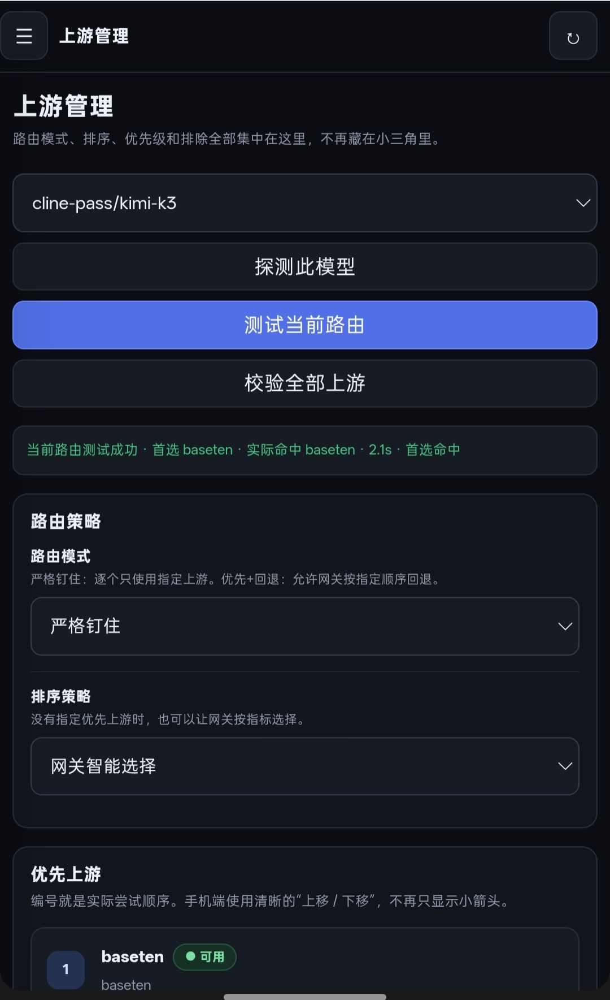
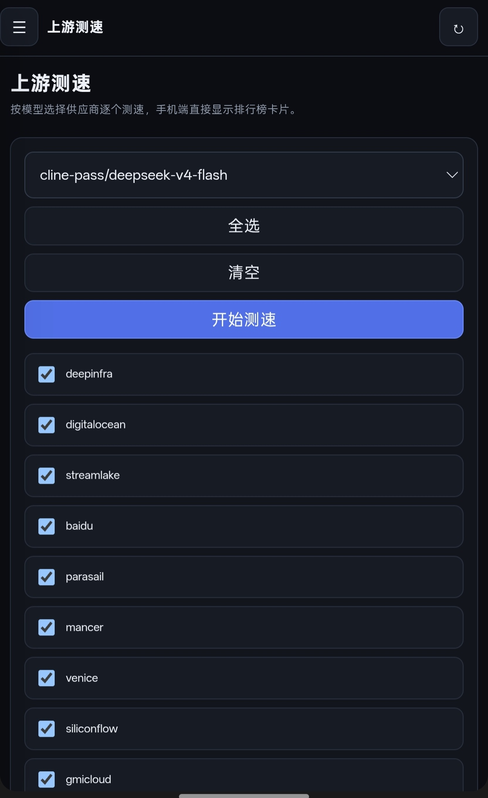
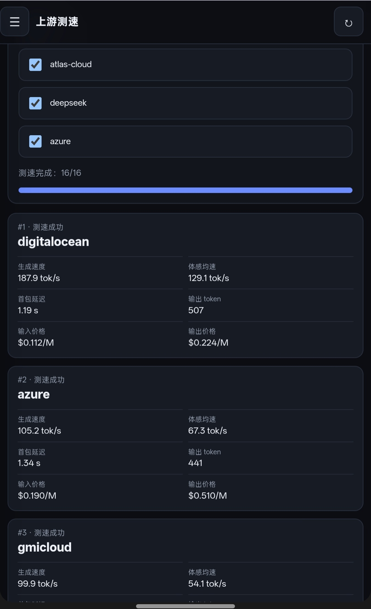
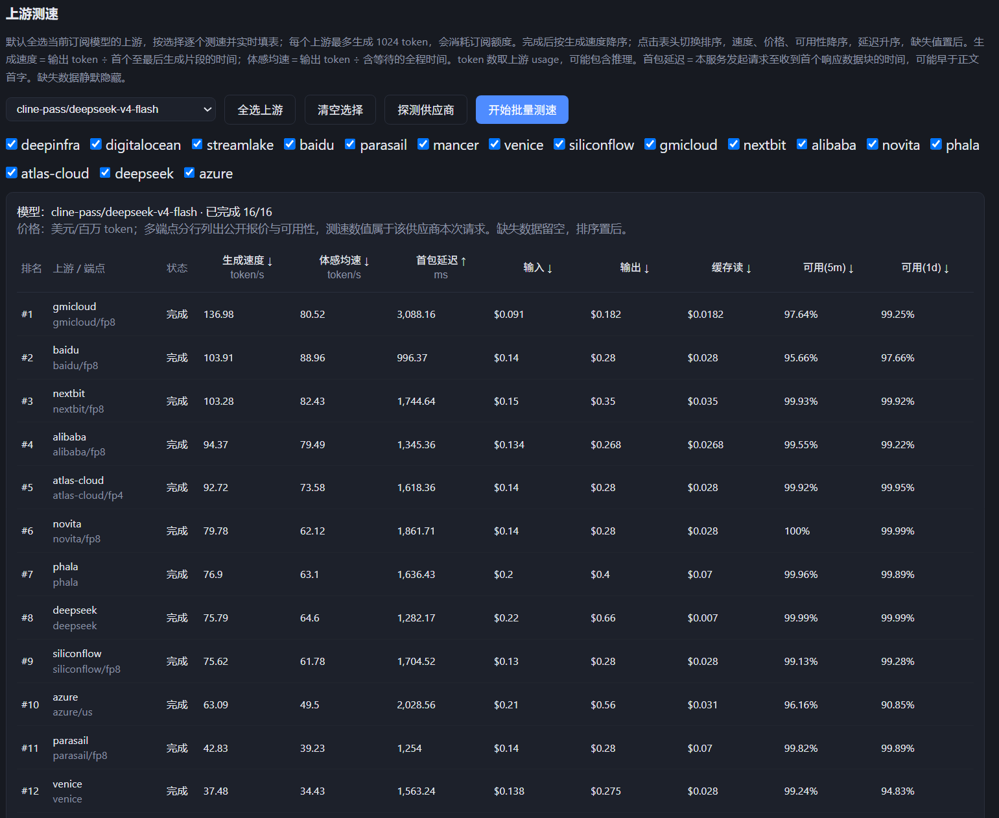

# Cline Pass 上游控制台（cline-pass-switcher）

本仓库是基于 [liqiming-whu/cline-pass-switcher](https://github.com/liqiming-whu/cline-pass-switcher) 的移动端适配修改版；原项目源自 [munmunjaklin458-afk/cline-pass-switcher](https://github.com/munmunjaklin458-afk/cline-pass-switcher)。

本版本重点优化手机端管理面板、上游管理、路由配置、测速与日常操作体验。

[](LICENSE)


这是一个**零依赖 Node.js 本地 / 服务器代理 + Web 控制台**，用于管理 [Cline Pass](https://cline.bot/cline-pass) 订阅模型背后的上游渠道，并向 OpenAI 兼容客户端提供统一 API。

---

## 主要功能

- 🔍 **模型与上游探测**  
  自动识别 Cline Pass 模型实际使用的路由管道、背后模型和可用上游。

- 🎯 **精确钉住上游**  
  支持严格钉住与优先 + 回退两种模式，并可配置多个上游的实际尝试顺序。

- 🧬 **多上游优先级故障转移**  
  第一个指定上游发生报错、网络失败或超时时，可自动切换到下一个；全部失败后才返回最终错误。

- 🚫 **上游排除**  
  被排除的上游不会参与自动选择、严格钉住候选或回退。

- 📊 **上游测速与指标**  
  可逐个实测生成速度、首包延迟、价格、缓存读取报价和可用性等指标。

- 👥 **账号池**  
  支持多个 Cline Pass 账号、启用 / 禁用、单账号模式和轮询模式，并可逐账号测试连通性。

- 📈 **请求观测**  
  查看实时请求、最近请求历史、实际命中的上游、耗时、错误和多上游尝试序列。

- 🔑 **代理密钥**  
  可给下游客户端设置独立代理密钥，与 Cline Pass 上游 API Key 分离。

- 🌐 **OpenAI 兼容接口**  
  OpenAI 兼容客户端只需要填写控制台显示的 API Base URL 即可接入。

---

## 控制台预览



当前控制台按日常使用流程拆分为 5 个页面：

1. 总览
2. 请求（实时请求与完整历史）
3. 路由与测速（包含模型拉取与全量探测）
4. 账号管理
5. 设置与安全

移动端为主要适配目标，同时保留桌面端布局。

手机端额外提供固定底部导航，将日常最常用的入口收敛为「首页、路由、请求、设置」。测速、模型拉取和模型探测已经并入路由页面，请求历史已经并入请求页面。首页可以选择模型、探测路由、校验上游并快速设置或取消首选厂商。

---

# Termux 一键部署（推荐）

Android / Termux 用户推荐使用一键部署脚本。

## 首次部署（新设备 / 新 Termux）

新设备首次安装时，建议先完整升级 Termux 软件包，再执行部署：

```bash
apt update && apt full-upgrade -y && apt install -y curl && curl -fsSL https://raw.githubusercontent.com/xfan5610-maker/cline-pass-switcher-v3/main/install-termux.sh | bash
```

这样可以尽量避免 Termux 因部分软件包升级不完整，导致 `curl`、`libcurl`、OpenSSL 等组件版本不一致。

安装脚本会自动完成：

- 检查 Termux 环境及软件包依赖状态；
- 检查 / 安装并验证 Git；
- 检查 / 安装 Node.js，并要求 Node.js ≥ 18；
- 检查并验证 npm；
- 检查 / 安装并验证 PM2；
- 下载项目到 `~/cline-pass-switcher-v3`；
- 检查 `server-v3.js` 语法；
- 启动 `cline-pass-v3` 后台服务；
- 检查 PM2 中的服务是否真正处于 `online`；
- 服务异常时输出最近日志并停止部署；
- 所有检查通过后保存 PM2 进程列表。

只有全部检查通过后，脚本才会显示部署完成。

部署完成后打开：

```text
http://127.0.0.1:3123/
```

没有 Cline Pass API Key 也可以先启动服务，进入控制台后再配置账号。

---

## 部署完成后怎么使用

### 1. 添加 Cline Pass 账号

打开：

```text
http://127.0.0.1:3123/
```

进入：

```text
账号管理
```

添加你的 Cline Pass API Key（`sk_` 开头）并保存。

---

### 2. 复制 API Base URL

回到「总览」。

页面会直接显示：

```text
API Base URL
http://127.0.0.1:3123/v1
```

点击旁边的「复制」按钮即可复制客户端需要填写的 Base URL。

---

### 3. 配置 OpenAI 兼容客户端

示例：

```text
Base URL: http://127.0.0.1:3123/v1
API Key:  在「设置与安全」中配置的代理密钥
Model:    cline-pass/glm-5.2
```

如果本地使用且没有设置代理密钥，API Key 可以留空。

---

## 更新 / 重新部署

已经正常部署过的设备，不需要每次都执行完整的 Termux 系统升级。

需要更新项目时，直接再次运行：

```bash
curl -fsSL https://raw.githubusercontent.com/xfan5610-maker/cline-pass-switcher-v3/main/install-termux.sh | bash
```

如果项目已经存在，脚本会：

- 拉取最新代码；
- 检查程序；
- 重新绑定并启动 PM2 服务；
- 确认服务状态为 `online`；
- 保存最新 PM2 进程列表。

因此同一条安装脚本也可以用于后续更新和重新部署。

---

## 常用 Termux 管理命令

查看运行状态：

```bash
pm2 ls
```

正常情况下应看到：

```text
cline-pass-v3  online
```

重启服务：

```bash
pm2 restart cline-pass-v3
```

查看日志：

```bash
pm2 logs cline-pass-v3
```

停止服务：

```bash
pm2 stop cline-pass-v3
```

手机重启，或者 Termux 被 Android 系统彻底关闭后，可以尝试：

```bash
pm2 resurrect
```

`pm2 resurrect` 会恢复之前通过 `pm2 save` 保存的 PM2 进程列表。

普通关闭 Termux 界面后重新打开，建议先执行：

```bash
pm2 ls
```

如果 `cline-pass-v3` 已经显示为 `online`，则不需要执行 `pm2 resurrect`。

---

## Termux 常见故障

### `CANNOT LINK EXECUTABLE` / `cannot locate symbol`

如果出现类似：

```text
CANNOT LINK EXECUTABLE "curl"
cannot locate symbol
```

通常说明 Termux 的软件包版本不一致，例如 `curl` / `libcurl` 与 OpenSSL 相关库没有处于同一套版本。

先执行：

```bash
apt update
apt full-upgrade -y
```

升级完成后，再重新执行首次部署命令。

---

### 没有选择 Termux 软件源 / 镜像不可用

如果出现类似：

```text
No mirror or mirror group selected
```

或者软件包无法正常更新，可以执行：

```bash
termux-change-repo
```

选择可用的软件源，然后执行：

```bash
apt update
apt full-upgrade -y
```

完成后再重新部署。

---

### 存在未完成的软件包配置

如果安装脚本提示检测到未完成的软件包配置，可以执行：

```bash
dpkg --configure -a
apt full-upgrade -y
```

处理完成后，再重新执行部署脚本。

---

### PM2 找不到

新版安装脚本会在安装 PM2 后强制检查：

```bash
command -v pm2
pm2 --version
```

如果 PM2 安装后仍无法执行，脚本会停止部署并输出 `PREFIX`、`PATH`、Node.js、npm、PM2 和 npm global prefix 等诊断信息，不会继续错误地显示“部署完成”。

---

# 当前控制台功能

## 1. 总览

总览页用于查看最常用的信息：

- 网关运行状态；
- API Base URL；
- 一键复制 API Base URL；
- 当前活动请求；
- 最近异常；
- 最近路由记录。

API Base URL 会根据当前配置自动显示。

本地默认：

```text
http://127.0.0.1:3123/v1
```

如果设置了公网代理地址，则会显示对应的公网 Base URL。

---

## 2. 实时请求

用于查看当前仍在执行中的请求。

可以看到：

- 当前模型；
- 目标上游；
- 请求持续时间；
- 最后收到数据的时间；
- 流式请求状态。

出现异常连接时可以单独终止对应请求。

---

## 3. 请求历史

保存最近的代理请求记录。

可查看：

- 模型；
- 账号；
- 实际命中的上游；
- 请求耗时；
- 成功 / 失败状态；
- 流式状态；
- 多上游尝试序列；
- 错误信息。

支持按模型、账号或上游搜索，并可筛选成功 / 异常记录。

---

## 4. 模型管理

模型管理页用于查看 Cline Pass 模型及其探测结果。

每个模型可显示：

- 背后模型；
- 当前路由管道；
- 上游数量；
- 最近实际命中的上游；
- 是否支持精确钉住。

探测后，模型会被识别为：

```text
Vercel
```

或：

```text
OpenRouter
```

复杂的路由配置集中在独立的「上游管理」页面中。

---

## 5. 上游管理

上游管理是当前版本主要的路由配置页面。

可以针对每个模型配置：

### 路由模式

```text
严格钉住
```

或：

```text
优先 + 回退
```

### 排序策略

可选择：

```text
网关智能选择
最低成本
最快首包
最高吞吐
```

### 优先上游

可以选择多个上游。

编号代表实际尝试顺序，并支持：

```text
上移
下移
```

### 排除上游

被排除的上游不会参与：

- 自动选择；
- 优先上游回退；
- 排除模式下的候选路由。

### 手动收录

如果某个上游没有自动出现在列表中，也可以填写对应的 upstream slug 手动加入监查列表。

### 路由测试

可以直接测试当前路由策略是否真正命中预期上游。

### 校验全部上游

可逐个实测当前模型的上游，并标记：

```text
✔ 可用
⏳ 限流
✘ 不可用 / 不可钉
```

---



---

## 6. 上游测速

上游测速页面用于真实测试多个上游。

选择模型后，可以：

- 全选当前模型的全部上游；
- 手动选择部分上游；
- 逐个执行测速；
- 随时停止测速。

单个上游最多生成：

```text
1024 token
```

单项超时：

```text
120 秒
```

因此批量测速会实际消耗订阅额度。

测速结果会显示为适合手机浏览的排行榜卡片。

主要指标包括：

- 生成速度；
- 体感均速；
- 首包延迟（TTFT）；
- 输入价格；
- 输出价格；
- 缓存读取价格；
- 短期可用性；
- 1 天可用性。

OpenRouter 与 Vercel 提供的指标窗口略有不同：

```text
OpenRouter：5m / 1d
Vercel：15m / 1d
```

缺失指标会自动隐藏，不会使用虚假数值补齐。

---





---

## 7. 账号管理

支持维护多个 Cline Pass 账号。

每个账号可以：

- 添加；
- 删除；
- 启用 / 禁用；
- 显示 / 隐藏 API Key；
- 单独测试连通性。

账号模式支持：

### 单账号

指定一个账号作为当前使用账号。

### 轮询

在所有启用账号之间轮询使用。

---

## 8. 设置与安全

低频配置集中在这里。

### 代理密钥

这是给下游 OpenAI 兼容客户端使用的独立密钥。

它与 Cline Pass 上游账号 Key 不同。

留空表示关闭下游鉴权。

---

### 公网代理地址

本机使用可以留空。

公网部署时可以填写：

```text
https://cline.example.com
```

不要在这里手动加 `/v1`。

控制台会自动生成客户端使用的：

```text
https://cline.example.com/v1
```

---

### 模型目录

开启后：

```text
/v1/models
```

会在订阅模型之外同时暴露完整公开模型目录。

默认关闭，以避免客户端模型列表过多。

---

### 稳定性信息

设置页还会显示：

- SSE 空闲保护；
- 累计卡流等运行状态。

---

# DeepSeek Flash 上游

当前版本对 DeepSeek Flash 补充了部分已知上游。

订阅入口：

```text
cline-pass/deepseek-v4-flash
```

预置 16 个上游。

目录模型入口：

```text
deepseek/deepseek-v4-flash
```

预置 29 个上游。

具体渠道是否仍然可用，应以当前实际：

```text
探测
测试
校验
测速
```

结果为准。

---

## DeepSeek Flash 测速观察



图中排名靠前的部分 endpoint 带有：

```text
fp8
fp4
```

标记。

这些 endpoint 标签来自 OpenRouter 提供的数据，因此可以作为量化版本的参考，但不保证所有标签都完全准确。

同样，endpoint 名称没有出现 `fp8` / `fp4`，也不能证明该端点一定没有使用量化。

根据截图对应的那次测速结果，排除明确带有 `fp8` / `fp4` 标记的端点后，`deepseek` 上游在该次测试中表现为：

- 首包延迟最低；
- 生成速度第二；
- 体感均速第一。

这只是该次测速的观察结果，实际表现会随时间、地区和网关负载变化。

---

# 核心机制：Cline Pass 的两条路由管道

Cline Pass 模型在 Cline 网关之后存在两种不同的路由管道。

它们钉住上游的方式并不相同。

| 管道 | 聚合网关 | 识别特征 | 上游控制方式 |
|---|---|---|---|
| **direct** | OpenRouter | 响应顶层带 `provider` 与真实 `model` | 顶层 `provider.only / order` |
| **planner** | Vercel AI Gateway | 响应带 `provider_metadata.gateway.routing` | `providerOptions.gateway.only / order / sort` |

控制台的「探测」会根据实际响应判断当前模型属于哪一种管道。

---

## Planner：Vercel AI Gateway

规划器管道的响应中通常可以看到：

```text
provider_metadata.gateway.routing
```

以及：

```text
canonicalSlug
finalProvider
fallbacksAvailable
planningReasoning
```

这一类模型的上游选择需要使用：

```json
{
  "providerOptions": {
    "gateway": {
      "only": ["alibaba"]
    }
  }
}
```

例如：

```json
{
  "model": "cline-pass/glm-5.2",
  "messages": [],
  "providerOptions": {
    "gateway": {
      "only": ["alibaba"]
    }
  }
}
```

实测响应可得到：

```text
finalProvider: alibaba
```

规划器理由中也会出现类似：

```text
Provider set restricted to: alibaba
```

参考：

[Vercel AI Gateway — Provider Filtering, Ordering & Sorting](https://vercel.com/docs/ai-gateway/models-and-providers/provider-filtering-and-ordering)

---

## Direct：OpenRouter

直连管道的响应顶层会出现：

```text
provider
model
```

这一类模型使用 OpenRouter 的：

```json
{
  "provider": {
    "only": ["gmicloud"]
  }
}
```

进行精确上游控制。

---

# 上游枚举机制

当前程序主要通过三种方式发现和补充上游。

## 1. 响应元数据

Planner 管道读取：

```text
canonicalSlug
fallbacksAvailable
finalProvider
```

Direct 管道读取顶层：

```text
provider
model
```

---

## 2. 假上游探测

程序会故意使用不存在的：

```text
__probe__
```

作为目标上游。

这样可以让网关在路由阶段直接返回当前支持的 provider 列表，而无需真正完成模型生成。

Direct 管道使用：

```text
provider.only
```

Planner 管道使用：

```text
providerOptions.gateway.only
```

两个管道返回的 provider 清单可能不同。

---

## 3. 聚合网关公开接口

Direct 管道会查询 OpenRouter：

```text
GET /api/v1/models/{slug}/endpoints
```

Planner 管道则查询 Vercel AI Gateway 对应 endpoint 数据。

这些公开接口主要用于补充：

- 价格；
- 首包延迟；
- 吞吐；
- 上下文长度；
- endpoint；
- 可用性。

---

# 实测记录（2026-09）

| 实验 | 结果 |
|---|---|
| glm-5.2 + 顶层 `provider.only/ignore/order` | 全部被网关丢弃，恒选同一渠道 |
| glm-5.2 + `providerOptions.gateway.only:["alibaba"]` | ✔ `finalProvider: alibaba` |
| glm-5.2 流式 + `only:["baseten"]` | ✔ 流式同样生效 |
| glm-5.2 + `providerOptions.gateway.sort:"cost"` | ✔ 按成本重排执行顺序 |
| glm-5.3-flash（direct）+ 顶层 `provider.only:["gmicloud"]` | ✔ `provider: "GMICloud"` |
| glm-5.3-flash + `providerOptions.gateway` | ✘ 无效 |

> 管道归属由 Cline 侧决定，未来可能变化。应以控制台当前探测结果为准。

---

# 多上游故障转移

如果一个模型选择多个优先上游，例如：

```text
alibaba
baseten
deepinfra
```

程序会按顺序尝试：

```text
alibaba
↓
失败
↓
baseten
↓
失败
↓
deepinfra
```

以下情况会进入下一上游：

- HTTP 错误；
- 网络失败；
- 超时；
- 上游返回不可用状态。

每次尝试都有独立超时。

当前默认单次尝试超时：

```text
120 秒
```

全部候选失败后，才把最终错误返回给客户端。

请求历史中会记录尝试序列。

响应头也可能包含：

```text
X-Cline-Target-Upstream
X-Cline-Attempts
X-Cline-Actual-Upstream
X-Cline-Account
```

---

# 本地手动运行

如果不使用 Termux 一键部署，也可以直接运行。

```bash
git clone https://github.com/xfan5610-maker/cline-pass-switcher-v3.git
cd cline-pass-switcher-v3
node server-v3.js
```

只需要：

```text
Node.js >= 18
```

无需：

```text
npm install
```

打开：

```text
http://127.0.0.1:3123/
```

本地语法检查：

```bash
node --check server-v3.js
```

---

# Docker 部署

以下 Docker 配置统一使用：

```text
server-v3.js
```

启动，并与本地运行使用相同的配置格式。

## 方式 A：All-in-one

自带 Caddy 自动 HTTPS。

有域名时：

```bash
mkdir -p data && cp config.example.json data/config.json

CPASS_DOMAIN=pass.example.com docker compose -f deploy/docker-compose.all-in-one.yml up -d --build
```

只有 IP 时：

```bash
docker compose -f deploy/docker-compose.all-in-one.yml up -d --build
```

访问：

```text
https://你的域名/
```

或：

```text
https://服务器IP/
```

IP 模式使用自签证书时，浏览器需要手动信任。

---

## 方式 B：已有反向代理

根目录的：

```text
docker-compose.yml
```

只启动应用，并绑定：

```text
127.0.0.1:3123
```

可以由 nginx / Caddy 等处理 TLS。

nginx 示例：

```nginx
location / {
    proxy_pass http://127.0.0.1:3123;
    proxy_http_version 1.1;
    proxy_set_header Host $host;
    proxy_set_header X-Forwarded-Proto https;
    proxy_buffering off;
    proxy_read_timeout 600s;
}
```

流式响应需要关闭代理缓冲。

---

# 环境变量

| 变量 | 说明 |
|---|---|
| `CLINE_PASS_KEY` | 上游 Cline Pass API Key |
| `PROXY_KEY` | 下游客户端代理密钥 |
| `PUBLIC_BASE_URL` | 公网代理地址，如 `https://pass.example.com` |
| `PORT` | 服务端口 |
| `BIND_HOST` | 服务监听地址 |
| `DATA_DIR` | 配置和运行数据目录 |

环境变量会在启动时覆盖 `config.json` 中对应配置。

之后如果通过控制台保存设置，当前生效值可能写回配置文件。

---

# 配置参考（config.json）

| 字段 | 说明 |
|---|---|
| `accounts` | 账号池：`[{ name, key, enabled }]` |
| `accountMode` | `single` / `roundrobin` |
| `activeAccount` | 单账号模式当前账号下标 |
| `proxyKey` | 下游代理密钥；空表示不鉴权 |
| `publicBaseUrl` | 公网代理地址 |
| `exposeCatalog` | 是否向 `/v1/models` 暴露完整公开目录 |
| `knownModels` | 当前订阅模型列表 |
| `perModel` | 每模型独立路由配置 |
| `apiKey` | 旧版单 Key 字段，启动时可迁移到账号池 |

`perModel` 主要结构：

```text
{
  upstreams: [],
  exclude: [],
  pinMode: strict | preferred,
  sort: cost | ttft | tps
}
```

旧版：

```text
upstream
```

字段仍作为兼容镜像保留。

---

# OpenAI 兼容

代理会对部分 Cline 返回格式进行兼容处理。

例如将：

```json
{
  "data": {}
}
```

形式的包装转换成更接近标准 OpenAI API 的响应。

错误也会统一为类似：

```json
{
  "error": {
    "message": "..."
  }
}
```

客户端一般只需要：

```text
Base URL
API Key
Model
```

即可使用。

---

# 常见问题

## 为什么某个上游无法单独钉住？

部分 provider 可能存在：

- 模型 ID 映射失败；
- 暂时限流；
- 网关当前不允许单独选择；
- provider 已经从当前模型的可用池中移除。

可以进入：

```text
上游管理
```

执行：

```text
校验全部上游
```

查看当前实际状态。

---

## 限流的上游还能用吗？

限流通常属于临时状态。

可以稍后重新校验，也可以使用：

```text
优先 + 回退
```

让失败或限流时自动尝试其他上游。

---

## 为什么两个模型看到的上游列表不一样？

不同模型可能属于：

```text
OpenRouter
```

或：

```text
Vercel AI Gateway
```

甚至同一个模型在不同管道下可用的 provider 池也可能不同。

因此应以对应模型当前的探测结果为准。

---

## 为什么官方 API 的 `provider.only` 有时不生效？

对于 Planner / Vercel AI Gateway 管道，顶层：

```text
provider.only
```

可能不会作为最终 Vercel 路由控制参数使用。

当前程序针对 Planner 管道使用：

```text
providerOptions.gateway
```

进行控制。

---

## 测速会消耗额度吗？

会。

上游测速会发送真实模型请求。

当前每个上游最多：

```text
1024 token
```

因此一次选择大量 provider 进行批量测速时，会产生实际订阅额度消耗。

---

# 安全提醒

- `config.json` 和 `data/` 可能包含明文 API Key；
- 这些运行数据已经通过 `.gitignore` 排除；
- 不要手动提交包含真实密钥的配置文件；
- 对外部署时建议设置 `proxyKey`；
- 多上游故障转移可能对多个 provider 发起连续尝试，请注意请求量和订阅额度。

---

# License

[MIT](LICENSE)
