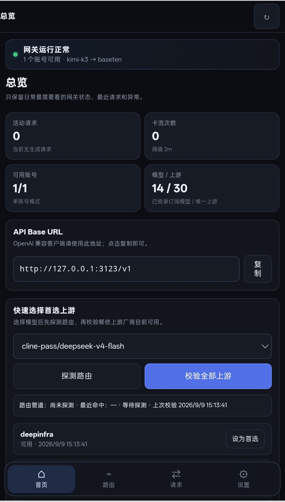
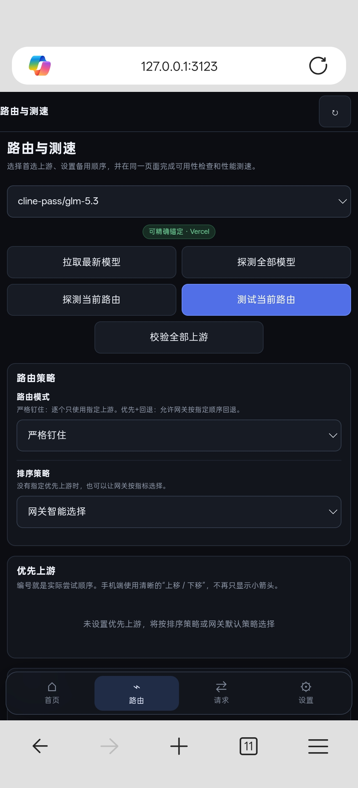

# Cline Pass 上游控制台（cline-pass-switcher）

> 当前版本：**v1.4.0**

本仓库是基于 [liqiming-whu/cline-pass-switcher](https://github.com/liqiming-whu/cline-pass-switcher) 的移动端适配修改版；原项目源自 [munmunjaklin458-afk/cline-pass-switcher](https://github.com/munmunjaklin458-afk/cline-pass-switcher)。

[](LICENSE)


这是一个**零依赖 Node.js 本地 / 服务器代理 + Web 控制台**，用于管理 [Cline Pass](https://cline.bot/cline-pass) 订阅模型背后的上游渠道，并向 OpenAI 兼容客户端提供统一 API。

本版本重点优化 Android / Termux 手机上的日常操作：路由、上游、测速和模型探测统一收敛，减少页面跳转和重复入口。

---

## 主要功能

- 🔍 **模型与上游探测**：识别模型所经过的路由管道、背后模型和可用上游。
- 🎯 **精确锚定上游**：支持严格锚定及“首选 + 回退”两种路由模式。
- 🧬 **多上游故障转移**：首选上游失败、网络异常或超时时，按顺序尝试下一上游。
- 🚫 **上游排除**：排除项不参与自动选择、精确锚定和回退。
- 📊 **上游测速**：实测生成速度、首包延迟、输入 / 输出价格和可用性。
- 👥 **账号池**：支持多账号、启用 / 禁用、单账号模式、轮询模式与逐账号连通性测试。
- 📈 **请求观测**：查看实时请求、请求历史、实际命中上游、耗时、错误和尝试序列。
- 🔑 **代理密钥**：下游客户端的代理密钥与 Cline Pass 上游 API Key 分离。
- 🌐 **OpenAI 兼容接口**：客户端只需填写控制台中的 API Base URL。
- 🧾 **路由证据 JSON**：探测、路由测试与测速返回统一的实际命中、候选上游、尝试链路和可识别响应头。

---

## 控制台与手机端布局






控制台主要页面为：

1. **总览**
2. **路由与测速**
3. **账号管理**
4. **请求**
5. **设置与安全**

手机端底部固定为四个高频入口：

```text
首页  路由  请求  设置
```

手机端不再提供顶部侧边栏按钮。账号管理属于设置的子页面，顶部提供“返回设置”。

### 总览

总览集中展示：

- 网关运行状态；
- API Base URL 与一键复制；
- 活动请求、最近异常、最近路由；
- 当前模型的快速路由探测与上游校验；
- 可用上游的“设为首选”或“取消首选”快捷操作。

取消首选后，该上游会立即恢复为普通的“设为首选”按钮。

### 路由与测速

模型拉取、全量探测、当前路由测试、上游校验、路由配置和性能测速均集中在此页面。选择当前模型后，页面顶部显示居中的路由通道标识，例如：

```text
可精确锚定 · OpenRouter
```

或：

```text
可精确锚定 · Vercel
```

未探测的模型显示“尚未探测路由”。该标识表示**当前模型的路由管道**，并不代表某一个具体厂商上游。

顶部操作布局如下：

```text
拉取最新模型   |   探测全部模型
探测当前路由   |   测试当前路由
                校验全部上游
```

“全部上游厂商”和“性能测速”默认折叠；展开后可筛选、查看单个上游、检查可用性、设置首选 / 自动 / 排除，或进行单项与批量测速。

### 请求

“实时请求”和“请求历史”通过同一页面顶部标签切换，不再存在重复的“查看完整历史”入口。

实时请求可查看当前模型、目标上游、持续时间、最后收到数据的时间和流状态；异常流可以单独终止。请求历史可搜索模型、账号或上游，并按成功 / 异常筛选。

历史仅保留最近 **10** 条，超过后自动删除最旧记录。列表默认只加载摘要；点“查看完整 JSON”才会读取该条请求、模型输出、路由证据和失败详情，避免手机页面卡顿。

### 上游名称匹配

路由测试会同时展示目标上游与网关返回名称。比较时会识别大小写、点号、连字符、下划线和常见别名差异，例如：

```text
目标 z-ai
网关返回 z.ai
```

会显示为“已命中（名称别名）”，不会误判为不可用。只有网关实际返回不同供应商时，才提示“请求成功但未按指定上游命中”。

---

# Termux 一键部署（推荐）

Android / Termux 用户可使用一键部署脚本。

## 首次部署（新设备 / 新 Termux）

新设备首次安装时，建议先完整升级 Termux 软件包：

```bash
apt update && apt full-upgrade -y && apt install -y curl && curl -fsSL https://raw.githubusercontent.com/xfan5610-maker/cline-pass-switcher-v3/main/install-termux.sh | bash
```

脚本会自动完成：

- 检查 Termux 环境、软件包依赖和未完成的软件包配置；
- 检查 / 安装 Git、Node.js（要求 ≥ 18）、npm 和 PM2；
- 下载或更新项目到 `~/cline-pass-switcher-v3`；
- 检查 `server-v3.js` 语法；
- 启动 `cline-pass-v3` 后台服务；
- 确认 PM2 服务真实处于 `online` 后保存进程列表。

部署完成后打开：

```text
http://127.0.0.1:3123/
```

没有 Cline Pass API Key 也可以先启动服务，随后在控制台的“账号管理”中添加。

## 更新 / 重新部署

已部署过的设备无需每次完整升级系统，直接再次执行：

```bash
curl -fsSL https://raw.githubusercontent.com/xfan5610-maker/cline-pass-switcher-v3/main/install-termux.sh | bash
```

脚本会拉取最新代码、重新检查并绑定 PM2 服务。

## 常用 Termux 命令

```bash
pm2 ls
pm2 restart cline-pass-v3
pm2 logs cline-pass-v3
pm2 stop cline-pass-v3
pm2 resurrect
```

正常运行时，`pm2 ls` 中应显示：

```text
cline-pass-v3  online
```

## Termux 常见故障

### `CANNOT LINK EXECUTABLE` / `cannot locate symbol`

通常是 `curl`、`libcurl` 或 OpenSSL 等软件包版本不一致。执行：

```bash
apt update
apt full-upgrade -y
```

完成后再运行部署命令。

### 没有可用软件源

如果提示 `No mirror or mirror group selected`，执行：

```bash
termux-change-repo
apt update
apt full-upgrade -y
```

### 存在未完成的软件包配置

```bash
dpkg --configure -a
apt full-upgrade -y
```

---

# 使用方法

## 1. 添加 Cline Pass 账号

打开控制台，进入：

```text
设置 → 账号管理
```

添加你的 Cline Pass API Key（通常以 `sk_` 开头）并保存。

## 2. 复制 API Base URL

在总览页复制：

```text
http://127.0.0.1:3123/v1
```

如果在设置中填写了公网代理地址，控制台会自动显示对应的公网 Base URL。

## 3. 配置 OpenAI 兼容客户端

```text
Base URL: http://127.0.0.1:3123/v1
API Key:  在「设置与安全」中配置的代理密钥
Model:    cline-pass/glm-5.2
```

本地使用且未设置代理密钥时，客户端 API Key 可以留空。

---

# 路由与上游机制

## 两条路由管道

Cline Pass 模型在 Cline 网关之后可能使用两种路由管道：

| 管道 | 聚合网关 | 上游控制方式 |
|---|---|---|
| `direct` | OpenRouter | 顶层 `provider.only / order / sort` |
| `planner` | Vercel AI Gateway | `providerOptions.gateway.only / order / sort` |

控制台的“探测当前路由”会根据实际响应自动判断管道。管道归属可能随 Cline 侧变化，因此应以当前探测结果为准。

## 上游探测

程序会通过以下方式收集当前模型的上游：

1. 读取响应元数据中的路由和实际供应商；
2. 使用不存在的 `__probe__` 上游，让网关返回可用 provider 列表；
3. 查询 OpenRouter 或 Vercel AI Gateway 的公开 endpoint 数据，以补充价格、首包延迟和吞吐参考。

公开指标不可用时不会影响路由探测和正常代理。

## 路由模式与故障转移

每个模型可以独立配置：

```text
严格锚定
首选 + 回退
```

“首选 + 回退”可配置多个上游。第一个上游发生 HTTP 错误、网络失败或超时时，代理会依次尝试后续上游；全部失败后才返回最终错误。

排序策略支持：

```text
网关智能选择
最低成本
最快首包
最高吞吐
```

---

# 路由证据 JSON

诊断接口统一附带 `evidence` 字段，用于区分“已确认的实际上游”和“仅作为候选的供应商”。返回结构为：

```json
{
  "schema": "cline-pass/upstream-evidence-v1",
  "confidence": "confirmed",
  "actual": { "provider": "anthropic", "source": "gateway.routing.finalProvider" },
  "routing": { "pipeline": "planner", "canonicalSlug": "anthropic/claude-sonnet-5" },
  "candidates": ["anthropic", "bedrock", "vertex"],
  "attempts": [],
  "responseHeaders": {}
}
```

可使用的诊断接口：

```text
POST /api/probe                    探测模型并保存最新证据
POST /api/test                     测试当前路由并返回本次证据
POST /api/speed-test               测速并返回本次证据
GET  /api/route-evidence?model=…  读取最近一次探测证据
```

`confidence=confirmed` 仅在响应明确提供最终供应商时出现；`candidate` 表示仅发现候选列表或公开元数据，不能据此断言实际命中。该功能不会改变 `/v1/chat/completions` 的 OpenAI 兼容响应或流式 SSE 格式。

---

# 测速说明

测速会对选定上游发送真实的流式生成请求，因此会消耗订阅额度。当前单项测速最多生成：

```text
1024 token
```

测速结果显示生成速度、体感均速、首包延迟、输出 token、输入价格和输出价格。速度与可用性会随地区、时间和网关负载变化，应以当前实测为准。

---

# 本地运行与 Docker

## 本地运行

```bash
git clone https://github.com/xfan5610-maker/cline-pass-switcher-v3.git
cd cline-pass-switcher-v3
node server-v3.js
```

只需要 Node.js ≥ 18，无需执行 `npm install`。

## Docker

根目录提供：

```text
docker-compose.yml
```

可按项目现有的 Docker Compose 配置启动应用；公网部署建议通过 nginx 或 Caddy 终止 TLS，并关闭流式响应缓冲。

---

# 配置参考

首次运行可参考：

```text
config.example.json
```

常用字段：

| 字段 / 环境变量 | 说明 |
|---|---|
| `accounts` / `CLINE_PASS_KEY` | Cline Pass 账号池或启动时的上游 Key |
| `accountMode` | `single` / `roundrobin` |
| `proxyKey` / `PROXY_KEY` | 下游客户端代理密钥；空表示不鉴权 |
| `publicBaseUrl` / `PUBLIC_BASE_URL` | 公网代理地址，不含 `/v1` |
| `PORT` | 服务端口，默认 `3123` |
| `BIND_HOST` | 服务监听地址 |
| `DATA_DIR` | 配置和运行数据目录 |
| `perModel` | 每个模型独立的上游、排除、路由模式与排序策略 |

建议通过 Web 控制台维护账号、密钥和路由配置。请勿提交包含真实 API Key 的 `config.json` 或运行数据。

---

# 安全提醒

- 对外部署时建议设置独立 `proxyKey`；
- 不要把 Cline Pass API Key、代理密钥或 `config.json` 提交到公开仓库；
- 批量测速和多上游回退都会产生真实请求，请留意订阅额度；
- 上游可用性、价格和速度会变化，实时探测与实际请求记录才是最终依据。

---

# License

[MIT](LICENSE)

本仓库为社区修改版本，与 Cline、OpenRouter、Vercel 等服务提供方不存在官方隶属关系。
